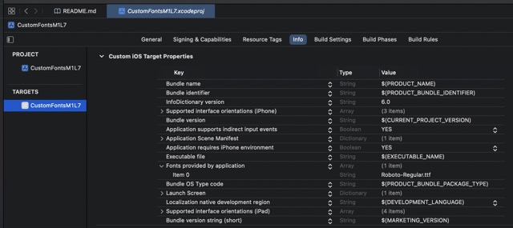

#  Custom Fonts in SwiftUI
Looking to import your cuostom fonts into your own iPhone app? You've come to the right place!
Read below for instructions on how to bring custom fonts into your apps. Instructions originally
from the wonderful iPhone development Design course by Chris Ching:
https://learn.codewithchris.com/courses/take/design/lessons/25824194-lesson-7-custom-fonts

Here are some websites, where you can download custom fonts:
- dafont.com
- fonts.google.com

# Importing Fonts Instructions
## Add File to Project & Plist
1) Download font style of your choice.
1) Drag/ drop into Xcode
 - Make sure you choose to copy items if needed
 - And add to targets!
1) Hit the plus icon in the bottom of the plist
1) Type "Fo" and choose the "Fonts provided by application"
1) From here, add the name of the new font, exactly as it appears in your file

Below, notice the "Fonts provided by application" with the font name as the first item in the list:


## Finding the Font Name
Next, once you find the font name, you need to call it within your project. In order to 
do that, you first need to find the name of the font. Unfortunately, this does not come straightforward:
you need to create a loop to loop through each of the font families and each of the font names on 
your system in order to get this information.
Execute this code in any file guaranteed to run in your project.
```
init() {
    // Loop through all the font families available on the system
    for familyName in UIFont.familyNames {
        print(familyName)
        
        // Loop through each of the font names in each of the families
        for fontName in UIFont.fontNames(forFamilyName: familyName) {
            print("--\(fontName)")
        }
        
    }
}
```
It should produce the following list with the name of your font found nearby:


## Calling the Custom Font
Now that you know the name of your custom font, you can call it by name via this method:
```
Text("Hello, world!")
    .font(.custom("Roboto-Regular", size: 60))
```
